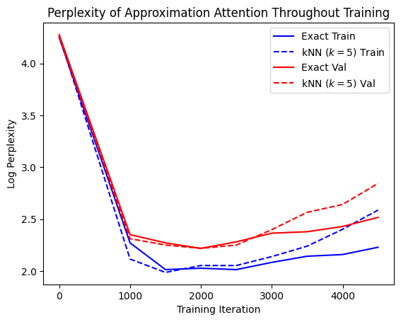
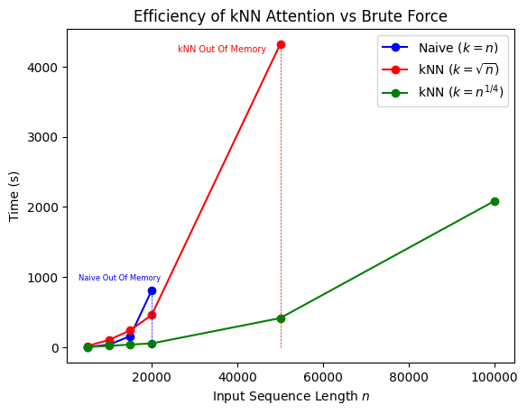

# Demystifying kNN Attention: A Theoretical Foundation
This repo contains experiments for the paper [Demystifying kNN Attention: A Theoretical Foundation](Link here).  




## Code Structure
The code structure can be seen below. Major files included only.
```
.
├── backward_pass
    ├── backward_pass.py: Implements the fast gradients
    └── experiment_grad_descent.py: Implements the experiment.
├── forward_pass
    ├── forward_pass.py: Implements vectorized fast attention
    └── forward_pass_test_simple.py: Contains unit tests for fast attention (1 batch, 1 head)
    └── forward_pass_test_batched.py: Contains unit tests for fast attention (multiple batches, multiple heads)
    └── figure_generation.ipynb: Contains logic for figure generation
├── naive_attention
    ├── naive_attention.py: Implements forward pass naively
└── naive_backprop
    └── naive_backprop.py: Implements gradients naively.
    └── testing_naive_backprob.py: Sanity checking for naive backprop
└── random_walk_simulation
    └── random_walk.py: Implements the MCMC algorithm framework
    └── random_walk_test.py: Unit tests for MCMC 
└── softmax_expectation
    └── softmax_expectation.py: Implements the softmax expectation via Gumbel noise.
    └── softmax_expectation_testing.py: Unit Testing
└── nanoGPT: contains experiments with Andrej Karpathy's nanoGpt.
└── _archived: contains old experiments and code.
```

Find created assets in *assets* directories.

## Replication Instructions

### Required Packages
For *nanoGpt*: follow the instructions on the repo there. The `knn_attention.py` file contains all the logic for KNN Attention, which is incorporated in the `model.py` and `train.py` files. 

For *everything else*: ensure you have `torch` installed. The code and experiments run on a CPU, and they use META's `faiss` package for KNN indexing, for which the documentation can be found [Here](https://faiss.ai/). If you want to scale these experiments to run on a GPU, you'll have to install the `faiss-gpu` package.

### Running the code
All experiments are in self-contained Python modules which you can simply run and modify. The `nanoGpt` experiments may require a GPU, but due to the versatility of the code can also be run using a simple Python command-line.

## Citation
If you use our method or work, please cite the [paper](link here):
```
@article{


}
```


